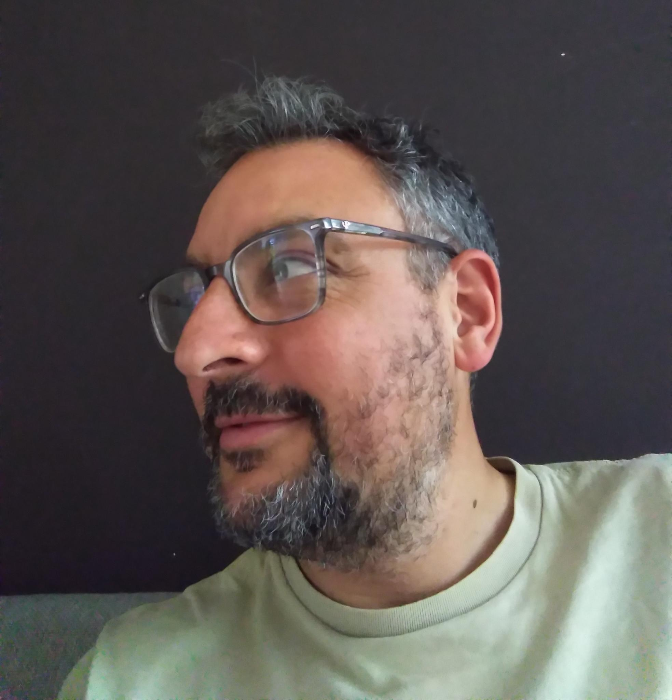

:::: {style="display: grid; grid-template-columns: 30% 65%; grid-column-gap: 1px; "}

::: {}

:::

::: {}
-----------        -------------------------------------------
Email:             [initial].[lastname] [at] tilburguniversity.edu
Office:            D108, Dante Building, Tilburg University
Address:           Department of Cognitive Science and Artificial Intelligence
                   Tilburg University
                   PO Box 90153
                   5000 LE Tilburg
                   The Netherlands
-----------        -------------------------------------------

:::

::::
# About me

I'm an assistant professor at the department of [Cognitive Science and AI of Tilburg University](https://research.tilburguniversity.edu/en/persons/bruno-nicenboim), PI of the [Computational Psycholinguistics Lab](https://www.tilburguniversity.edu/about/schools/tshd/departments/dca/lab/computational-psycholinguistics). Before that I did my PhD and Postdoc in [Shravan Vasishth's lab](http://www.ling.uni-potsdam.de/~vasishth/), at the Department of Linguistics of University of Potsdam, Germany. 

<a rel="me" href="https://fediscience.org/@bruno_nicenboim">[Mastodon]</a>
[[~~Twitter~~]](https://twitter.com/bruno_nicenboim)
[[Github]](https://github.com/bnicenboim)
[[ORCID]](http://orcid.org/0000-0002-5176-3943)
[[OSF]](https://osf.io/cmist/#!)

---

 

# My Main Interests

## Computational Cognitive Modeling

I study computational cognitive modeling of psycholinguistic phenomena, with some examples below:

- Nicenboim, B. (2023). "The CoFI Reader: A Continuous Flow of Information approach to modeling reading." In: MathPsych/ICCM/EMPG. University of Amsterdam, the Netherlands. [[read]](https://mathpsych.org/presentation/998#/document)

- Nicenboim, B. and S. Vasishth (2018). "Models of Retrieval in Sentence Comprehension: A computational evaluation using Bayesian hierarchical modeling." In: *Journal of Memory and Language*, 99, pp. 1–34. ISSN: 0749-596X. DOI: 10.1016/j.jml.2017.08.004. [[read]](https://arxiv.org/abs/1612.04174)

I am also interested in broader aspects of computational modeling:

- Dubova, M., S. Chandramouli, G. Gigerenzer, P. Grünwald, W. Holmes, T. Lombrozo, M. Marelli, S. Musslick, **B. Nicenboim**, L. N. Ross, et al. (2025). "Is Ockham's razor losing its edge? New perspectives on the principle of model parsimony." In: *Proceedings of the National Academy of Sciences*, 122(5), p. e2401230121. DOI: 10.1073/pnas.2401230121. [[read]](https://www.pnas.org/doi/abs/10.1073/pnas.2401230121)

- I organized the Lorentz Centre "Cognitive Modeling of Complex Behavior" workshop in January 2024, along with [Riccardo Fusaroli](https://fusaroli.weebly.com) and [Marieke van Vugt](https://mkvanvugt.wordpress.com/). This hands-on event focused on collaborative modeling of cognitive phenomena. See [here](https://www.lorentzcenter.nl/cognitive-modeling-of-complex-behavior.html).

- I served as the local chair of the 57th Annual Meeting of the Society for Mathematical Psychology (MathPsych) and the 22nd International Conference on Cognitive Modeling (ICCM) 2024. [(conference link)](https://mathpsych.org/conference/15/).

## EEG in Psycholinguistics

I also work with EEG in psycholinguistics:

- I'm currently finishing a project focusing on self-paced EEG data for benchmarks and computational modeling in the context of an [NWO Open Competition SGW XS grant](https://www.nwo.nl/en/researchprogrammes/open-competition-ssh/granted-projects).

- K. Stone, B. Nicenboim, S. Vasishth, et al. "Understanding the effects of constraint and predictability in ERP." In: *Neurobiology of Language* (Dec. 2022), pp. 1-71. DOI: 10.1162/nol_a_00094. [[read]](https://direct.mit.edu/nol/article-pdf/doi/10.1162/nol/_a/_00094/2062866/nol/_a/_00094.pdf)

- B. Nicenboim, S. Vasishth, and F. Rösler. "Are words pre-activated probabilistically during sentence comprehension? Evidence from new data and a Bayesian random-effects meta-analysis using publicly available data." In: *Neuropsychologia*, 142 (2020), p. 107427. DOI: 10.1016/j.neuropsychologia.2020.107427. [[read]](https://psyarxiv.com/2atrh/)

I also developed an R package for EEG data manipulation: [eeguana](https://bnicenboim.github.io/eeguana/).

## Bayesian Statistics

Bayesian statistics provides a powerful framework for cognitive science by allowing principled uncertainty quantification and hierarchical modeling. I mostly work with Stan (and brms):

- [Bayesian Statistics for Cognitive Scientists](https://bruno.nicenboim.me/bayescogsci) (in progress), co-authored with [Shravan Vasishth](http://www.ling.uni-potsdam.de/~vasishth/) and [Daniel Schad](https://danielschad.github.io/).

- [Stan for Cognitive Science](https://cognitive-science-stan.github.io/): A resource hub for Bayesian modeling with Stan.

## Data and Code

Most of the data and code from my published papers are available on the [OSF website](https://osf.io/cmist/), with some exceptions in my [GitHub repository](https://github.com/bnicenboim).

<!-- And I'm also contributing to the [list of publicly available psycholinguistics datasets](https://github.com/tmalsburg/PsychlingDatasets/wiki/A-directory-of-publicly-available-data-sets-from-psycholinguistic-studies).  -->

---

## News

- I'll be talking about how Bayesia model comparison can go wrong in [Bayes in Bayonne: Methods Workshop for Linguistics and Cognitive Sciences (17th June, 2025)](https://bayes-bayonne-workshop.gitlab.io/).

- A new recurring meeting on computational psycholinguistics, co-organized with [Jakub Dotlačil](https://www.jakubdotlacil.com/), [Lena Jäger](https://www.cl.uzh.ch/en/research-groups/digital-linguistics/people/group-leader/jaeger.html), and me, will take place in Utrecht on December 18–19, 2025. **Deadline is very soon: June 29, 2025** More details on the [official website](https://cpl2025.sites.uu.nl/).

<!-- Together with [Riccardo Fusaroli](https://fusaroli.weebly.com) and [Marieke van Vugt](https://mkvanvugt.wordpress.com/), we organized a Lorentz Centre "Cognitive Modeling of Complex behaviour" hands-on workshop in January 2024.  The core of the workshop was self-organized group work, where participants together tackle the modeling of a phenomenon of interest. See  -->
<!-- [here](https://www.lorentzcenter.nl/cognitive-modeling-of-complex-behavior.html). -->

---
##  Recent posts

<!-- <\!-- -------------- -\-> -->

<!-- - I'll be teaching at the  [The Third Potsdam Summer School on Statistical Methods for Linguistics and Psychology (SMLP)](https://vasishth.github.io/smlp2020/), University of Potsdam, Germany. **7-11th September, 2020**. -->

<!--   -->

