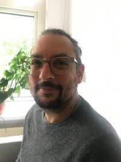

:::: {style="display: grid; grid-template-columns: 30% 65%; grid-column-gap: 1px; "}

::: {}

:::

::: {}
-----------        -------------------------------------------
Email:             [initial].[lastname] [at] tilburguniversity.edu
Office:            D108, Dante Building, Tilburg University
Address:           Department of Cognitive Science and Artificial Intelligence
                   Tilburg University
                   PO Box 90153
                   5000 LE Tilburg
                   The Netherlands
-----------        -------------------------------------------

:::

::::
# About me

I'm an assistant professor at the department of [Cognitive Science and AI of Tilburg University](https://research.tilburguniversity.edu/en/persons/bruno-nicenboim) and a guest researcher at the department of Linguistics the University of Potsdam, Germany. Before that I did my PhD and Postdoc in [Shravan Vasishth's lab](http://www.ling.uni-potsdam.de/~vasishth/), at the Department of Linguistics of University of Potsdam, Germany. 

[Twitter](https://twitter.com/bruno_nicenboim)
[Github](https://github.com/bnicenboim)
[ORCID](http://orcid.org/0000-0002-5176-3943)
[OSF](https://osf.io/cmist/#!)

---

 

# My main interests

## Computational (cognitive) modeling 

- Projects involving of computational (cognitive) models in a Bayesian framework (using [Stan](https://mc-stan.org/)/brms). Recently, in [a paper led by Clare Patterson about German personal and demonstrative pronouns ](http://www.frontiersin.org/language_sciences/10.3389/fpsyg.2016.00280/abstract),  I contributed with the Bayesian implementation of the models and model comparison.

- Computational cognitive models that link memory processes with sentence comprehension, and individual differences in sentence processing. The most important output of my PhD was [this paper about models of retrieval](papers/NicenboimVasishth2017Models.pdf); DOI: [10.1016/j.jml.2017.08.004](https://doi.org/10.1016/j.jml.2017.08.004). The paper shows the computational implementation of two different sentence processing theories (a verbal model and an ACT-R model) on the same framework using hierarchical Bayesian modeling. 

- Decision making models. See here my attempt of a fully hierarchical linear ballistic accumulator in Stan ([Stancon submission](https://htmlpreview.github.io/?https://github.com/stan-dev/stancon_talks/blob/master/2018-helsinki/Contributed-Talks/nicenboim/LBA_stancon2018.html)).

## EEG

- An R package for the manipulation of EEG data: https://bnicenboim.github.io/eeguana/. It is fully functional, but it's only able to do basic preprocessing for EEG data.  Feedback and comments (and [github issues](https://github.com/bnicenboim/eeguana/issues)) are welcome.

- Predictions in language using EEG. In [this paper](https://psyarxiv.com/2atrh/), we use novel EEG data, together with a meta-analysis of available data, and we show that the N400 effect is, at
least in part, caused by linguistic preactivation that occurs prior to the predicted target word, as opposed to semantic integration that occurs after the target word has been read. While this idea has been present in the literature for more than 10 years, experimental evidence has been so far controversial and included several failed replications. 

 
##  Bayesian statistics 

- [Bayesian statistics for cognitive scientists textbook](https://vasishth.github.io/Bayes_CogSci/) (in progress) together with [Shravan Vasishth](http://www.ling.uni-potsdam.de/~vasishth/) and [Daniel Schad](https://danielschad.github.io/).  I have also been collaborating with Shravan Vasishth, Daniel Schad, and others (in different orders) in papers that deal with [sample size determination for Bayesian models](https://link.springer.com/article/10.1007/s42113-021-00125-y), [the robust use of Bayes factor](Robust Use of {Bayes} Factors), and [data aggregation in mixed models]().

- [Stan for cognitive science website](https://cognitive-science-stan.github.io/) with resources for Bayesian modeling with Stan.

----

## Data and code

Data and code for my published papers  is mostly in the [OSF website](https://osf.io/cmist/) (with some exceptions in my [github](https://github.com/bnicenboim) repo). And I'm also contributing to the [list of publicly available psycholinguistics datasets](https://github.com/tmalsburg/PsychlingDatasets/wiki/A-directory-of-publicly-available-data-sets-from-psycholinguistic-studies). 

---

##  Recent posts

<!-- #### News  -->

<!-- <\!-- -------------- -\-> -->

<!-- - I'll be teaching at the  [The Third Potsdam Summer School on Statistical Methods for Linguistics and Psychology (SMLP)](https://vasishth.github.io/smlp2020/), University of Potsdam, Germany. **7-11th September, 2020**. -->

<!--   -->

