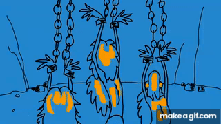

## What is computational modeling?

-   A formal descriptions of human thought and behavior.
-   A mediator between theory and data

. . .

::: smaller
> Computational modeling is the process by which a verbal description is formalized to remove ambiguity \[...\], while also constraining the dimensions a theory can span. In the best of possible worlds, modeling makes us think deeply about what we are going to model (e.g., which phenomenon or capacity), in addition to any data, both before and during the creation of the model and both before and during data collection.

(Guest & Martin, 2022)
:::

## Why a computational model?

-   As an alternative to an implicit model:
    -   in which the assumptions are hidden,
    -   their internal consistency is untested,
    -   their logical consequences are unknown,
    -   and their relation to data is unknown. \]

[@epstein2008model]

# Goal of model comparison {.center style="text-align: center;"}

------------------------------------------------------------------------

:::::: columns
::: {.column width="50%"}
{width="600"}
:::

:::: {.column width="50%"}
::: incremental
-   Which theory is closer to the truth?
-   The model that best accounts for the data is used as **proxy**.
-   We implement theories as Bayesian models and compare their predictive power.
:::
::::
::::::

## Two approaches

::::: columns
::: {.column width="50%"}
### Bayes factor

-   Evaluates data support through "prior" model predictions.
-   Strong prior dependence when models differ qualitatively.
:::

::: {.column width="50%"}
### Bayesian Cross-Validation

-   Evaluates data support through "posterior" model predictions on held out data.
-   Conservative approach; cautious about selecting models.
:::
:::::

. . .

::::: columns
::: {.column width="50%"}
-   *A cruel realist*, penalizes models for not having optimal prior information [@jaynes2003probability]
:::

::: {.column width="50%"}
-   Likened to *a fair judge*, ensures fairness by allowing models to perform at their best
:::
:::::

## References {.unnumbered}

::: {#refs}
:::

## Appendix {.unnumbered}
