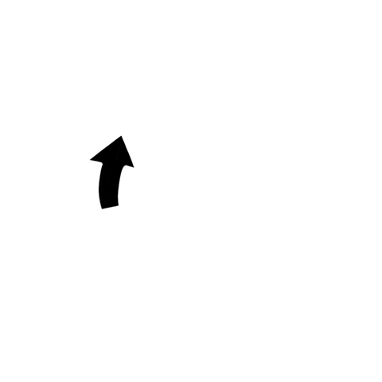

## Outline

- Computational modeling: the what, why, and how
- Case study: What happens to model comparison when our models are misspecified?
- Wrapping up: key takeaways and conclusions

## Computational Psycholinguistics Meeting

::::: columns
::: {.column width="40%"}
{width="800"}

:::
::: {.column width="60%"}

Dec 18--19, 2025, Utrecht, the Netherlands

Submit your abstract by June 29, 2025 (AoE)

:::
:::::

We welcome work on computational models explaining/predicting human language

::::: columns
::: {.column width="40%"}
- production
- perception
:::
::: {.column width="60%"}
- learning
- processing
:::
:::::

👉 [https://cpl2025.sites.uu.nl/](https://cpl2025.sites.uu.nl/)


## What is computational modeling? 


- A formal descriptions of human thought and behavior.
- A mediator between theory and data 

. . .

::: {.smaller}

> Computational modeling is the process by which a verbal description is formalized to remove ambiguity [...], while also constraining the dimensions a theory can span. In the best of possible worlds, modeling makes us think deeply about what we are going to model (e.g., which phenomenon or capacity), in addition to any data, both before and during the creation of the model and both before and during data collection. 

(Guest & Martin, 2022)


:::

## Why a computational model? 
 
 - As an alternative to an implicit model:
    - in which the assumptions are hidden, 
    - their internal consistency is untested,
    - their logical consequences are unknown, 
    - and their relation to data is unknown. ]

[@epstein2008model]

# Goal of model comparison {.center style="text-align: center;"}

------------------------------------------------------------------------

:::::: columns
::: {.column width="50%"}
{width="600"}
:::

:::: {.column width="50%"}
::: incremental
-   Which theory is closer to the truth?
-   The model that best accounts for the data is used as **proxy**.
-   We implement theories as Bayesian models and compare their predictive power.
:::
::::
::::::

## Two approaches {background-image="comparison.png" background-opacity=0.15}


::::: columns
::: {.column width="50%"}
### Bayes factor

::::  {.fragment}
-   Evaluates data support through "prior" model predictions.
-   Strong prior dependence when models differ qualitatively.
:::::
:::


::: {.column width="50%"}

### Bayesian Cross-Validation 


::::  {.fragment}

-   Evaluates data support through "posterior" model predictions on held out data.
-   Conservative approach; cautious about selecting models.

:::::

:::
::::


. . .

::::: columns
::: {.column width="50%"}
-   *A cruel realist*: penalizes models for not having optimal prior information.
:::

::: {.column width="50%"}
-  *A fair judge*: ensures fairness by allowing models to perform at their best [@jaynes2003probability]
:::
:::::


## TL;DR

### Important considerations in model comparison

::: incremental
-   Generalization is within observed data range
-   A predictive model is not necessarily a true model
-   Quantitative evaluation cannot replace the qualitative understanding of data patterns.
:::

[@Nicenboim2024Bayesian]


::: notes
1.  **Generalization within observed data range**:
    -   Generalization is limited to the range of observed data.
    -   Superiority of one model in a specific population doesn't guarantee its superiority in a broader population.[@VehtariLampinen2002; @VehtariOjanen2012; @henrich_heine_norenzayan_2010]
    -   Importance of using historical benchmark data for model evaluation.[@navarroDevilDeepBlue2018; @NicenboimPreactivation2019]
2.  **Qualitative understanding**:
    -   Quantitative evaluation cannot replace the qualitative understanding of data patterns.
    -   A good fit may contradict substantive knowledge, necessitating model re-evaluation. [@navarroDevilDeepBlue2018; @lisson_2020]
3.  **A predictive model is not necessarility a true model**:
    -   BF and CV focus on finding the most useful model for characterizing data.
    -   No guarantee of selecting the model closest to the truth even with ample data[@WangGelman2014difficulty; @navarroDevilDeepBlue2018].
:::

# Case Study: How do model comparison work when our models are mispecified?

# (and our models are always mispecified)

## Outline of the case study 

::::: columns
::: {.column width="70%"}

:::::: incremental
- Simulate data from a given model under different conditions.
  1. Fit *some* conditions with models *different* from the true model (mispecification).
  2. Compare the models with BF and CV.
  3. Repeat.
:::::: 
:::


::: {.column width="30%"}
:::::: fragment

:::::: 
:::

:::::


## Simulated task 

<!-- (ref:LDT-tikz)  -->

:::{.center}

```{r, engine = 'tikz'}
\usetikzlibrary{positioning}
\begin{tikzpicture}
  \tikzset{
        basefont/.style = {font = \Large\sffamily},
          timing/.style = {basefont, sloped,above,},
           label/.style = {basefont, align = left},
          screen/.style = {basefont, white, align = center,
                           minimum size = 6cm, fill = black!60, draw = white}};

  % macro for defining screens
  \newcommand*{\screen}[4]{%
    \begin{scope}[xshift  =#3, yshift = #4,
                  every node/.append style = {yslant = 0},
                  yslant = 0.33,
                  local bounding box = #1]
      \node[screen] at (3cm,3cm) {#2};
    \end{scope}
  }
  % define several screens
  \screen{frame1}{\textbf+} {0}     {0}
  \screen{frame2}{rurble}{150} {-60}
  \screen{frame3}{\textbf+}         {300}{-120}
  \screen{frame4}{monkey}{450}{-180}


\end{tikzpicture}
\end{document}
\end{tikzpicture}
```

*Lexical decision task (LDT)*

:::


## True generative process


```{r}
#| label: load-packages
#| include: false
# Packages in use
library(rtdists)
library(tidytable) # faster replacement of dplyr
library(ggplot2)
library(latex2exp) # for math symbols in ggplots
library(rstan)
library(bayesplot)
library(posterior)
library(bridgesampling)
library(loo)
options(mc.cores = parallel::detectCores())
source("aux.R")
# Plots
bayesplot_theme_set(theme_light())
theme_set(theme_light())
theme_update(plot.title = element_text(hjust = 0.5))
options(ggplot2.continuous.colour = scale_color_viridis_c)
options(ggplot2.continuous.fill = scale_fill_viridis_c)
options(ggplot2.discrete.colour = scale_color_viridis_d)
options(ggplot2.discrete.fill = scale_fill_viridis_d)
color_scheme_set("viridis")
options(digits = 2)
```


::::: columns
::: {.column width="75%"}

```{r}
#| message: false
#| fig.keep: true
#| fig.width: 4.5
#| fig.height: 3
#| out.width: "90%"
#| out.heigth: "50%"
#
b <- 1.3

A <- 0.5
p <- 0.2
plot <- ggplot() + geom_hline(yintercept=b, linetype = 2) + 
          annotate("text",x=.1, y= b+.05, label=TeX('Threshold',output='character'), parse=TRUE)+
          annotate("rect",xmin=0,ymin=0, xmax=.025, ymax= A, fill="gray",color="black")+
          annotate("text",x=.6, y=  .8, label=TeX('Drift rate $v \\sim `Gamma`(k,\\theta)$',output='character'), parse=TRUE)+
          annotate("segment",x=0, y=p, xend=1, yend= .9, color="black",arrow= arrow(length = unit(0.03, "npc")) )+
          annotate("text",x=.4, y= .18, label=TeX('Initial state $p \\sim Uniform(0, A)$',output='character'), parse=TRUE)+
          scale_x_continuous(limits=c(0,1.1),expand = c(0, 0),breaks=0, name=TeX("Decision time $t$ (Response time = $t + T_0$)"))+
          scale_y_continuous(limits=c(0,1.5),expand = c(0, 0),breaks=c(0,p, A, b),labels=c(0,"p","A","b")  , name="Evidence") +
          theme(axis.text = element_text(size = rel(1)))
plot
```
:::

::: {.column width="25%"}
Decision in LDT as a Linear Ballistic Accumulator  [LBA: @brownSimplestCompleteModel2008] with a Gamma distribution for the rates [@Terry2015].

:::
:::::

## True values

```{r}
df_pars <- tribble(
  ~difficulty,    ~emphasis,   ~A,   ~b, ~scale_v1, ~shape_v1, ~scale_v2, ~shape_v2, ~t0,
   "easy",         "accuracy",  .5,   5.1,   5,       6,         12,       1,         .1,
   "hard",         "accuracy",  .5,   5.1,  4.2,      6,         12,       1,         .1,
   "easy",         "speed",    3.9,   4.1,   5,       6,         12,       1,         .1,
   "hard",         "speed",    3.9,   4.1,  4.2,      6,         12,       1,         .1
)
df_pars |>    kableExtra::kbl(  
     caption = "Parameter values under different conditions"  
  ) |>  
  kableExtra::kable_styling(font_size = 29, bootstrap_options = c("striped", "condensed"))
```

::: notes
The differences in emphasis do not alter the parameters that relate to the speed or noise in the accumulation process. They affect the parameters that control the distance that needs to be accumulated: - by increasing the likelihood that the initial position ($p$) is near the threshold (by increasing $A$) and - by decreasing the distance to the threshold ($b$).
:::

-----


```{r, message = FALSE, class.source = 'fold-hide'}
set.seed(123)
N_cond <- 400
df_sim <- df_pars |>
  pmap_df(function(A,b,t0, scale_v1, scale_v2, shape_v1, shape_v2, difficulty, emphasis, ...) {
    rLBA(N_cond, A = A, b = b, t0 = t0,
         scale_v = c(scale_v1, scale_v2),
         shape_v = c(shape_v1, shape_v2),
         distribution = "gamma" ) |>
      mutate(rt = rt * 1000, # to ms
             difficulty = difficulty,
             emphasis = emphasis)
  }) |> mutate(diff = ifelse(difficulty == "hard",1,-1),
               emph = ifelse(emphasis =="speed",1,-1),
               resp = ifelse(response ==1, "correct","incorrect"),
               acc= ifelse(response ==1, 1, 0))

```

```{r}
#| fig.width: 9
#| fig.height: 3
#| out.width: "90%"
ggplot(df_sim, aes(x = rt, y = resp)) + 
  geom_violin(draw_quantiles = c(.025,.5,.975), scale = "count", alpha = .5) +
  geom_jitter(alpha = .2, width = 0, height = .25) +
  facet_grid(emphasis ~ difficulty) +
  xlab("Response time [ms]") +
  ylab("Accuracy")
```

```{r}
options(digits = 2)

df_sim |> summarize(correct = mean(response==1),
                    rt_correct = mean(rt[response==1]),
                    sd_correct = sd(rt[response==1]),
                    rt_incorrect = mean(rt[response==2]),
                    sd_incorrect = sd(rt[response==2]),
                    .by = c("emphasis","difficulty"))|>
  kableExtra::kbl( digits = 2 
  ) |>  
  kableExtra::kable_styling(font_size = 29, bootstrap_options = c("striped", "condensed"))

```

::: notes
The simulated data mimic several patterns observed in real-world data, including (i) a predominance of correct over incorrect responses, (ii) a positive skew in response times, (iii) the standard deviation of response times increasing alongside the mean, and (iv) an increase in difficulty resulting in both more incorrect responses and prolonged response times. Additionally, it reflects a speed-accuracy trade-off, where faster decisions tend to be less accurate and slower decisions are more accurate. When speed is emphasized, response times for errors are shorter compared to when accuracy is emphasized, attributable to the shorter distance to the decision threshold.
:::

# Case 1. Modeling only fast answers (Speed emphasis)

## 1.a  Models under consideration {.smaller}


```{r, message = FALSE, results = "hide", class.source = 'fold-hide'}
set.seed(123)
df_sim_speed <- df_sim |>
  filter(emphasis == "speed") |>
  group_by(difficulty) |>
  mutate(train = rbinom(n(), 1, .9))
df_sim_speed_train <-  df_sim_speed |>
  filter(train == 1)
dsim_speed_list <- list(N = nrow(df_sim_speed_train),
                  rt =df_sim_speed_train$rt,
                  response = df_sim_speed_train$response,
                  K = 1,
                  X = model.matrix(~ 0 + diff, df_sim_speed_train),
                  only_prior = 0)

fits_speed <- list()
```

**1. Log-Normal Race (LNR) model**

Simple race between accumulators--threshold and drift can't be disentangled (conceptually similar to LBA)

-   \<RT, response\> $\sim$ LNR
-   very weak priors

. . .

**2. Theory-agnostic model with normal likelihood**

-   RT $\sim$ Normal
-   response $\sim$ Bernoulli

. . .

**3. Theory-agnostic model with shifted log-normal likelihood**

-   (RT $-$ shift) $\sim$ LogNormal
-   response $\sim$ Bernoulli

::: notes
Next, I investigate what would happen if all the data obtained is from a participant who emphasizes speed.

The LNR model is the closest to the true generating process, but the priors are relatively ill-defined, much weaker than what we actually know. The theory-agnostic models are very flexible, with the second one allowing for a closer fit to the positively skewed response time.
:::

```{r stan1a, message = FALSE, results = "hide"}
inuse <- c("pred_rt","pred_response","log_lik")

fits_speed$LNRace <-  load_or_fit("fits_speed_LNRace.RDS",
                                    stan("./LogNormalRace_badpriors.stan",
                          data = dsim_speed_list,
                          warmup = 1000,
                          iter = 10000,
                          pars = inuse))


fits_speed$agnostic <- load_or_fit("fits_speed_agnostic.RDS", stan("./Agnostic.stan", 
                            data = dsim_speed_list,
                            warmup = 1000,
                            iter = 10000,
                          pars = inuse,
                          save_warmup = FALSE))


fits_speed$agnosticLog <- load_or_fit("fits_speed_agnosticLog.RDS" , stan("./AgnosticLog.stan",
                               data = dsim_speed_list,
                               warmup = 1000,
                               iter = 10000,
                               pars = inuse,
                               save_warmup = FALSE))

```

## 1.a PPC {.scrollable}

```{r violin-acc}
violins <- map2(fits_speed, names(fits_speed), ~ violin_plot(df_sim_speed_train, .x)  + ggtitle(.y) )
walk(violins, ~ plot(.x))
```

## 1.a Model comparison

```{r bf-speed, message = FALSE, results = "hide", eval = !file.exists("lm_speed_1.RDS")}
lm_speed <- map(fits_speed, ~ bridge_sampler(.x))
```

```{r loo-speed, eval = !file.exists("loo_speed_1.RDS")}
loo_speed <- map(fits_speed, ~ loo(.x))
```

```{r, echo = FALSE, results = "hide", message = FALSE}
saveread("lm_speed", filename= "lm_speed_1.RDS")
saveread("loo_speed", filename= "loo_speed_1.RDS")
```

#### Bayes factor

```{r}
bf_compare(lm_speed) 
```

#### LOO CV

```{r}
loo_compare(loo_speed) 
```

::: fragment

**The most flexible model won!**

:::

::: notes
Both BF and $\widehat{elpdf}$-CV agree that the best model is the theory-agnostic with a log-normal likelihood. **This shows that the model that is closer to the truth is not necessarily the one with the best predictions. A flexible theory-agnostic model might yield the best predictions even if it doesn't resemble the generative process. Crucially, this is true for both BF and CV.**
:::

## 1.b Another competitor

**4. Ollman's [-@Ollman1966] fast guess model** 

- mixture of two processes 
   - a guessing mode 
   - a task-engaged mode 
- captures the speed-accuracy trade-off **because of the wrong reasons**

```{r FG-speed, message = FALSE, results = "hide"}
#| cache.lazy = FALSE
fits_speed$FG <- load_or_fit("fits_speed_FastGuess.RDS",
                                    stan("./FastGuess.stan",
                          data = dsim_speed_list,
                          warmup = 1000,
                          iter = 10000,
                          pars = inuse))


```

## 1.b Model comparison

```{r, message = FALSE, results = "hide", eval = !file.exists("loo_speed_2.RDS")}
lm_speed$FG <- bridge_sampler(fits_speed$FG)
loo_speed$FG <- loo(fits_speed$FG)
```

```{r, echo = FALSE, results = "hide", message = FALSE}
saveread("lm_speed", filename= "lm_speed_2.RDS")
saveread("loo_speed", filename= "loo_speed_2.RDS")
```

::::: columns
::: {.column width="50%"}
#### Bayes factor

```{r}
bf_compare(lm_speed) 
```
:::

::: {.column width="50%"}
#### LOO-CV

```{r}
loo_compare(loo_speed)
```
:::
:::::

. . .

The more flexible model is still the winner...

. . .

### Only cognitive models

::::: columns
::: {.column width="50%"}

#### Bayes factor

```{r}
bf_compare(lm_speed[!startsWith(names(lm_speed),"agnostic")])
```
:::

::: {.column width="50%"}
#### LOO-CV

```{r}
loo_compare(loo_speed[!startsWith(names(lm_speed),"agnostic")])
```
:::
:::::

::: fragment

- BF chooses the wrong model. (But the LNR had weak prior.)
- CV is undecided.

:::

::: notes
BF shows a clear advantage for the Fast Guess model. This is a bit unsettling because the Fast Guess model is clearly different from the true generating process. $\hat{elpdf}$-CV cannot distinguish between the models.
:::


## 1.b + better priors

```{r, include = FALSE, message = FALSE}
#| cache.lazy = FALSE
  fits_speed$LNRace_reg_priors <- load_or_fit("fits_speed_LNRace_reg_priors.RDS", stan("./LogNormalRace.stan",   
                      data = dsim_speed_list,
                      warmup = 1000,
                      iter = 10000,
                      pars = inuse))


if (!file.exists("lm_speed_2b.RDS")) {
  loo_speed$LNRace_reg_priors <- loo(fits_speed$LNRace_reg_priors$draws("log_lik"))
} 

saveread("loo_speed", filename= "loo_speed_2b.RDS")
saveread("lm_speed", filename= "lm_speed_2b.RDS")


```

::::: columns
::: {.column width="50%"}
#### Bayes factor

```{r}
bf_compare(lm_speed) 
```
:::

::: {.column width="50%"}
#### LOO-CV

```{r}
loo_compare(loo_speed)
```
:::
:::::

. . .

### Only cognitive models
::::: columns
::: {.column width="50%"}

#### Bayes factor

```{r}
bf_compare(lm_speed[!startsWith(names(lm_speed),"agnostic")])
```
:::

::: {.column width="50%"}
#### LOO-CV

```{r}
loo_compare(loo_speed[!startsWith(names(loo_speed),"agnostic")]) |> round(2)
```
:::
:::::

::: fragment

- Now BF chooses a conceptually more correct model.
- CV is still undecided.

:::


## Case 1.c Yet another competitor

5.  A more flexible implementation of the LNR model

-   It relaxes the assumption that the noise parameter is the same for all the accumulators.

   a.  with very uninformative priors
   b.  with regularizing priors.


```{r, include = FALSE, message = FALSE}
#| cache.lazy = FALSE

fits_speed$LNRace_fl <- load_or_fit("LNRace_fl.RDS", stan("./LogNormalRace_fl_badpriors.stan",
                               data = dsim_speed_list,
                               warmup = 1000,
                               iter = 10000,
                               control = list(adapt_delta = .9,
                                              max_treedepth = 12), 
                          pars = inuse))

                          
fits_speed$LNRace_fl_reg_priors <- load_or_fit("LNRace_fl_better_priors.RDS",stan("./LogNormalRace_fl.stan",
                                          control = list(adapt_delta = .9,
                                                         max_treedepth = 12),
                                          data = dsim_speed_list,
                                          warmup = 1000,
                                          iter = 10000,
                                          ))
if(0){

  lm_speed$LNRace_fl <- bridge_sampler(fits_speed$LNRace_fl)

  lm_speed$LNRace_fl_reg_priors <- bridge_sampler(fits_speed$LNRace_fl_reg_priors)
  saveRDS(lm_speed$LNRace_fl, "lm_LNRace_fl.RDS")
  saveRDS(lm_speed$LNRace_fl_reg_priors, "lm_LNRace_fl_better_priors.RDS")
}

  lm_speed$LNRace_fl <- readRDS("lm_LNRace_fl.RDS")
  lm_speed$LNRace_fl_reg_priors <- readRDS("lm_LNRace_fl_better_priors.RDS")


loo_speed$LNRace_fl <- loo(fits_speed$LNRace_fl)
loo_speed$LNRace_fl_reg_priors <- loo(fits_speed$LNRace_fl_reg_priors)
```


## 1.c PPC {.scrollable}

```{r}
#| cache.lazy = FALSE
fit_plot <- fits_speed[!endsWith(names(fits_speed),"reg_priors")]
violins <- map2(fit_plot, names(fit_plot), ~ violin_plot(df_sim_speed_train, .x)  + ggtitle(.y) )

walk(violins, ~ plot(.x))
```


## 1.c PPC {.scrollable}

```{r, message = FALSE}
dens_speed <- map2(
  fit_plot, 
  names(fit_plot), ~ ppc_dens_overlay_grouped(df_sim_speed_train$rt,
                                           yrep = extract(.x,pars = "pred_rt")[[1]][1:200,, drop = FALSE],
                                           group = df_sim_speed_train$difficulty) +

  coord_cartesian(xlim= c(0, 1500)) + ggtitle(.y))
walk(dens_speed, ~ plot(.x ))
```

## 1.c Model comparison 3 {.scrollable}

::::: columns
::: {.column width="50%"}
#### Bayes factor

```{r}
bf_compare(lm_speed)  
```
:::

::: {.column width="50%"}
#### LOO-CV

```{r}
loo_compare(loo_speed)|> round(2) 

```
:::
:::::

. . .

- BF chooses the flexible LNR model with good priors. 
- CV is still undecided.

. . .

### Only cognitive models
::::: columns
::: {.column width="50%"}

#### Bayes factor

```{r}
bf_compare(lm_speed[!startsWith(names(lm_speed),"agnostic")])
```
:::

::: {.column width="50%"}
#### LOO-CV

```{r}
loo_compare(loo_speed[!startsWith(names(loo_speed),"agnostic")]) |> round(2)
```
:::
:::::


::: fragment
- Both methods agree. 
:::


## Fast guess vs Flexible LNR

```{r} 
df_sim_speed_train <- ungroup(df_sim_speed_train) %>%
  mutate(diff_elpd_LNRF_FG =  loo_speed$LNRace_fl$pointwise[,"elpd_loo"] -  loo_speed$FG $pointwise[,"elpd_loo"],
         diff_elpd_LNRF_AL =  loo_speed$LNRace_fl$pointwise[,"elpd_loo"] -  loo_speed$FG$pointwise[,"elpd_loo"])


ggplot(df_sim_speed_train,
       aes(x = rt, y = diff_elpd_LNRF_FG)) +
  geom_jitter(alpha = .5, width = 0, height = .1 ) +
  facet_grid(difficulty ~ resp) +
  geom_hline(yintercept = 0, linetype = "dashed")
```

# Case 2. Accuracy emphasis

```{r fit-acc, results = "hide", message = FALSE, eval = !file.exists("fits_acc.RDS")}
set.seed(123)
df_sim_acc <- df_sim |>
  filter(emphasis =="accuracy") |>
  group_by(difficulty) |>
  mutate(train = rbinom(n(),1,.9))
df_sim_acc_train <-  df_sim_acc |>
  filter(train==1)
dsim_acc_list <- list(N = nrow(df_sim_acc_train),
                      rt =df_sim_acc_train$rt,
                      response = df_sim_acc_train$response,
                      K = 1,
                      X = model.matrix(~ 0 + diff, df_sim_acc_train),
                      only_prior = 0)

fits_acc <- list()
fits_acc$LNRace <- stan("./LogNormalRace_badpriors.stan",
                        data = dsim_acc_list,
                        warmup = 1000,
                        iter = 10000,
                        pars = inuse,
                        save_warmup = FALSE)

fits_acc$LNRace_reg_priors <- stan("./LogNormalRace.stan",
                                   data = dsim_acc_list,
                                   warmup = 1000,
                                   iter = 10000,
                        pars = inuse,
                        save_warmup = FALSE)


fits_acc$agnostic <- stan("./Agnostic.stan",
                          data = dsim_acc_list,
                          warmup = 1000,
                          iter = 10000,
                        pars = inuse,
                        save_warmup = FALSE)


fits_acc$agnosticLog <- stan("./AgnosticLog.stan",
                             data = dsim_acc_list,
                             warmup = 1000,
                             iter = 10000,
                        pars = inuse,
                        save_warmup = FALSE)


fits_acc$FG <- stan("./FastGuess.stan",
                    data = dsim_acc_list,
                    warmup = 1000,
                    iter = 10000,
                        pars = inuse,
                        save_warmup = FALSE)


fits_acc$LNRace_fl <- stan("./LogNormalRace_fl_badpriors.stan",
                           data = dsim_acc_list,
                           control = list(adapt_delta = .9,
                                          max_treedepth = 12),
                           warmup = 1000,
                           iter = 10000,
                        pars = inuse,
                        save_warmup = FALSE)


fits_acc$LNRace_fl_reg_priors <- stan("./LogNormalRace_fl.stan",
                                      data = dsim_acc_list,
                                      control = list(adapt_delta = .9,
                                                     max_treedepth = 12),
                                      warmup = 1000,
                                      iter = 10000,
                        pars = inuse,
                        save_warmup = FALSE)


```

```{r accs, echo = FALSE, message = FALSE, results = "hide"}
#| cache.lazy = FALSE
saveread("fits_acc")
saveread("df_sim_acc_train")
```

## 2. Posterior predictive check


```{r}
#| cache.lazy = FALSE
fit_plot <- fits_acc[!endsWith(names(fits_acc),"reg_priors")]

violins <- map2(fit_plot, names(fit_plot), ~ violin_plot(df_sim_acc_train, .x)  + ggtitle(.y) )

walk(violins, ~ plot(.x))
```
## 2. Model comparison {.scrollable}

```{r bf-acc, message = FALSE, results = "hide", eval = !file.exists("loo_acc.RDS")}
lm_acc <- map(fits_acc, ~ bridge_sampler(.x))
loo_acc<- map(fits_acc, ~ loo(.x))
```

```{r, echo = FALSE, message = FALSE, results = "hide"}
saveread("lm_acc")
saveread("loo_acc")
```

::::: columns
::: {.column width="50%"}
#### Bayes factor

```{r}
bf_compare(lm_acc)  

```
:::

::: {.column width="50%"}
#### LOO-CV

```{r}
loo_compare(loo_acc)|> round(2) 

```
:::
:::::

. . .


- Both methods select the theory-agnostic model

. . .

### Only cognitive models
::::: columns
::: {.column width="50%"}

#### Bayes factor

```{r}
bf_compare(lm_acc[!startsWith(names(lm_acc),"agnostic")])
```
:::

::: {.column width="50%"}
#### LOO-CV

```{r}
loo_compare(loo_acc[!startsWith(names(loo_acc),"agnostic")]) |> round(2) 
```
:::
:::::


. . .

- Fast Guess model is selected!


# Case 3. Considering both speed and accuracy emphasis

```{r fit-all, results = "hide", message = FALSE, eval = !file.exists("fits.RDS")}
set.seed(123)

df_sim <- df_sim |>
  group_by(difficulty) |>
  mutate(train = rbinom(n(),1,.9))
df_sim_train <-  df_sim |>
  filter(train==1)

dsim_list <- list(N = nrow(df_sim_train),
                  rt =df_sim_train$rt,
                  response = df_sim_train$response,
                  K = 2,
                  X = model.matrix(~ 0 + diff + emph , df_sim_train),
                  only_prior = 0)

fits <- list()
fits$LNRace <- stan("./LogNormalRace_badpriors.stan",
                    data = dsim_list,
                    warmup = 1000,
                    iter = 10000)

fits$LNRace_reg_priors <- stan("./LogNormalRace.stan",
                               data = dsim_list,
                               warmup = 1000,
                               iter = 10000)
 
fits$agnostic <- stan("./Agnostic.stan",
                      data = dsim_list,
                      warmup = 1000,
                      iter = 10000)

fits$agnosticLog <- stan("./AgnosticLog.stan",
                         data = dsim_list,
                         warmup = 1000,
                         iter = 10000)

fits$FG <- stan("./FastGuess.stan",
                data = dsim_list,
                warmup = 1000,
                iter = 10000)

fits$LNRace_fl <- stan("./LogNormalRace_fl_badpriors.stan",
                       data = dsim_list,
                       warmup = 1000,
                       iter = 10000,
                       control = list(adapt_delta = .9,
                                      max_treedepth = 12))
fits$LNRace_fl_reg_priors <- stan("./LogNormalRace_fl.stan",
                                  data = dsim_list,
                                  warmup = 1000,
                                  iter = 10000,
                                  control = list(adapt_delta = .9,
                                                 max_treedepth = 12))
```

```{r, echo = FALSE, message = FALSE, results = "hide"}
#| cache.lazy = FALSE
saveread("fits")
saveread("df_sim_train")
```

## 3. PPC {.scrollable}


```{r}
#| cache.lazy = FALSE

fit_plot <- fits[!endsWith(names(fits),"reg_priors")]
violins <- map2(fit_plot, names(fit_plot), ~ violin_plot(df_sim_train, .x)  + ggtitle(.y) )

walk(violins, ~ plot(.x))
```

## 3. Model comparison {.scrollable}

```{r bf-all, message = FALSE, results = "hide", eval = !file.exists("loo.RDS")}
lm <- map(fits, ~ bridge_sampler(.x))
loo<- map(fits, ~ loo(.x))
```

```{r, echo = FALSE, message = FALSE}
saveread("lm")
saveread("loo")
```

::::: columns
::: {.column width="50%"}
#### Bayes factor

```{r}
bf_compare(lm)  

```
:::

::: {.column width="50%"}
#### LOO-CV

```{r}
loo_compare(loo)|> round(2) 

```
:::
:::::

. . .

- BF does select the best model! (but it still selects theory-agnostic as better than some conceptually correct models) 
- CV can't distinguish between the theory agnostic the best model.


# Key Takeaways 


## Don't mistake the map for the territory

:::::: columns

:::: {.column width="30%"}

{width="300"}

::: fragment

But don't throw the map away!
:::

::::

:::: {.column width="70%"}
::: incremental

* Generalization stays within observed data
* Predictive ≠ true model
* Explanatory models need constraints:

  * data, theory, and biology/physics
* Quantitative checks ≠ full understanding
* Good models make testable, risky predictions

* Bayes Factors: priors matter (a little or a lot)
* CV: often inconclusive without clear gains

:::

::::
:::::: 

::: notes 
-   Don't mistake the map for the territory.

-   Generalization happens *within* the range of observed data.

-   A predictive (flexible) model isn’t necessarily a true model.

-   Explanatory models should be constrained by:

    -   **Data**, including experimental manipulations or diverse ecological observations
    -   **Theory**, since we’re implementing a theoretical framework
    -   **Biological or physical constraints**, when that information is available

-   Quantitative evaluation is important, but it cannot replace a qualitative understanding of data patterns.

-   A good model should make testable, non-trivial predictions  (Mehl's "risky predictions").

-   For Bayes Factors, priors matter (sometimes a little, sometimes a lot).

-   Cross-validation often remains inconclusive unless there is a clear improvement in predictive performance.

:::


## References {.unnumbered}

::: {#refs}
:::

## 2. Visualization of elpd {.unnumbered .scrollable}

- Flexible LNRace vs FG

```{r} 
df_sim_train <- ungroup(df_sim_train) %>%
  mutate(diff_elpd_LNRF_FG =  loo$LNRace_fl$pointwise[,"elpd_loo"] -  loo$FG $pointwise[,"elpd_loo"])


ggplot(df_sim_train,
       aes(x = rt, y = diff_elpd_LNRF_FG)) +
  geom_jitter(alpha = .5, width = 0, height = .1 ) +
  facet_grid(difficulty ~ resp + emphasis) +
  geom_hline(yintercept = 0, linetype = "dashed")
```

- Flexible LNRace vs Theory-agnostic Log

```{r} 
df_sim_train <- ungroup(df_sim_train) %>%
  mutate(diff_elpd_LNRF_AL =  loo$LNRace_fl$pointwise[,"elpd_loo"] -  loo$agnosticLog $pointwise[,"elpd_loo"])


ggplot(df_sim_train,
       aes(x = rt, y = diff_elpd_LNRF_AL)) +
  geom_jitter(alpha = .5, width = 0, height = .1 ) +
  facet_grid(difficulty ~ resp + emphasis) +
  geom_hline(yintercept = 0, linetype = "dashed")
```
