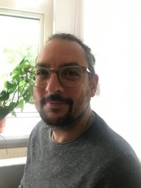

 
 
 
 
 

-----------        -------------------------------------------
Email:             [initial].[lastname] [at] uvt.nl
Office:            D108, Dante Building, Tilburg University
Address:           Department of Cognitive Science and Artificial Intelligence
                   Tilburg University
                   PO Box 90153
                   5000 LE Tilburg
                   The Netherlands
-----------        -------------------------------------------
 
 

 
 
 
 

# About me

 

I'm an assistant professor at the department of [Cognitive Science and AI of Tilburg University](https://research.tilburguniversity.edu/en/persons/bruno-nicenboim) and a guest researcher at the department of Linguistics the University of Potsdam, Germany. Before that I did my PhD and Postdoc in [Shravan Vasishth's lab](http://www.ling.uni-potsdam.de/~vasishth/), at the Department of Linguistics of University of Potsdam, Germany. 

---

 

### My main interests

#### Computational (cognitive) modeling 

- I worked on computational cognitive models that link memory processes with sentence comprehension, and on individual differences in sentence processing. The most important output of my PhD was [this paper about models of retrieval](papers/NicenboimVasishth2017Models.pdf); DOI: [10.1016/j.jml.2017.08.004](https://doi.org/10.1016/j.jml.2017.08.004). The paper shows the computational implementation of two different sentence processing theories (a verbal model and an ACT-R model) on the same framework using hierarchical Bayesian modeling. 

- I'm currently working with the linear ballistic accumulator (see my [Stancon submission](https://htmlpreview.github.io/?https://github.com/stan-dev/stancon_talks/blob/master/2018-helsinki/Contributed-Talks/nicenboim/LBA_stancon2018.html)).

#### EEG

- I worked on predictions in language using EEG [(preprint)](https://psyarxiv.com/2atrh/); using novel EEG data, together with a meta-analysis of available data, we show that the N400 effect is, at
least in part, caused by linguistic preactivation that occurs prior to the predicted target word, as opposed to semantic integration that occurs after the target word has been read. While this idea has been present in the literature for more than 10 years, experimental evidence has been so far controversial and included several failed replications. 

- I'm developing a package for the manipulation of EEG data in R: https://bnicenboim.github.io/eeguana/. It is in the early stages of development, but feedback and comments (and [github issues](https://github.com/bnicenboim/eeguana/issues)) are welcome.

 
####  Statistical methods and Bayesian modeling: 

- I'm working on [this textbook](https://vasishth.github.io/Bayes_CogSci/) (in progress) together with [Shravan Vasishth](http://www.ling.uni-potsdam.de/~vasishth/) and [Daniel Schad](https://danielschad.github.io/). 

- Data and code for my published papers  is mostly in the [OSF website](https://osf.io/cmist/) (with some exceptions in my [github](https://github.com/bnicenboim) repo). And I'm also contributing to the [list of publicly available psycholinguistics datasets](https://github.com/tmalsburg/PsychlingDatasets/wiki/A-directory-of-publicly-available-data-sets-from-psycholinguistic-studies). 

- I'm mantaining the [Stan for cognitive science website](https://cognitive-science-stan.github.io/) with resources for Bayesian modeling with Stan.

<!-- #### News  -->

<!-- <\!-- -------------- -\-> -->

<!-- - I'll be teaching at the  [The Third Potsdam Summer School on Statistical Methods for Linguistics and Psychology (SMLP)](https://vasishth.github.io/smlp2020/), University of Potsdam, Germany. **7-11th September, 2020**. -->

<!--   -->

<!-- # News -->

<!-- &#128197; I'm teaching the following workshops/summer schools: -->

<!-- * Methods in Advanced Statistics together with Shravan Vasishth at the 2020 Winter School organized by Netherlands Graduate School in Linguistics (LOT) in Tilburg, Netherlands. **13-17th January, 2020** -->

<!-- * an introduction to computational Bayesian methods using Stan together with Shravan Vasishth in Berlin in the framework of [Physalia courses](https://www.physalia-courses.org/courses-workshops/course46/). **16-20th March, 2020** -->

<!-- -  advanced Bayesian methods using [Stan](http://mc-stan.org/) at the [The Third Potsdam Summer School on Statistical Methods for Linguistics and Psychology (SMLP)](https://vasishth.github.io/smlp2020/), University of Potsdam, Germany. **7-11th September, 2020**. -->

<!-- - -->

<!-- 
*  An introductory workshop on Bayesian methods  at the University of Edinburgh, UK. **14th and 15th September, 2019**.

* Another introductory workshop on Bayesian methods  at the University of Cologne, Germany. **24th and 25th September, 2019**.

&#128197; "Computational models of retrieval processes in sentence processing" got accepted in TiCS! Preprint is [here](https://psyarxiv.com/e4jds).

&#128197; I'm teaching advanced Bayesian methods using [Stan](http://mc-stan.org/) at the [The Third Potsdam Summer School on Statistical Methods for Linguistics and Psychology (SMLP)](https://vasishth.github.io/smlp2019/), University of Potsdam, Germany. **9-14th September, 2019**.

&#128197; I'll be giving a talk on "Statistical inference: Alternative tools and paradigms" at [BICLCE 2019](https://www.uni-bamberg.de/en/anglistik/chair-of-english-linguistics/biclce-2019/), at the Otto-Friedrich-Universität Bamberg, Germany. **Between 26th and 28th September, 2019**

# News

&#128197; **24 October 2018** I will be talking about *Cognitive models of memory processes in sentence comprehension* at the [Masterclass in Bayesian Statistic](https://www.chairejeanmorlet.com/2018-2-mengersen-pudlo-1854.html), CIRM (Marseille Luminy, France).  

&#128197; **30 or 31 August 2018** I will be talking about a Stan implementation of the linear ballistic accumulator at [StanCon](http://mc-stan.org/events/stancon2018Helsinki/) in Helsinki, Finland.

&#128197; **8 September 2018** Ernesto Guerra and I will be presenting a poster (A crack in the crystall ball: Evidence against pre-activation of gender features in sentence comprehension) at [AMLAP](https://amor.cms.hu-berlin.de/~knoeferp/AMLaP2018/Home.html) in Berlin, Germany.	

&#128197; **10 - 14 September 2018** I will be assisting [Michael Betancourt](https://betanalpha.github.io/) and teaching one Bayesian modeling one morning at the [The Second Potsdam Summer School on Statistical Methods for Linguistics and Psychology (SMLP)](https://vasishth.github.io/SMLP2018/), University of Potsdam, Germany.  

&#128197; **17 September 2018** I will be talking about the testing of psychological theories using a Bayesian approach
 in the symposium "Bayesian Approaches in Psychological Research" at [Kongress der Deutschen Gesellschaft für Psychologie](https://www.dgpskongress.de/frontend/index.php?sub=16) in Frankfurt, Germany.	

♣ [My poster](https://osf.io/dhd7y/) will be hanging at [CUNY 2017](https://cuny2017.mit.edu) **without me** or my co-author [Shravan Vasishth](http://www.ling.uni-potsdam.de/~vasishth) this Thursday (March 30th). But I'll be happy to get feedback by e-mail or twitter. And you can check our manuscript under review [here](https://arxiv.org/abs/1612.04174).

<!-- 
&#128197;  I'll be giving a talk about Bayesian models in psycholinguistics at the Institut für Linguistik - Phonetik, University of Cologne on **July 3rd, 2017**.
 -->
<!-- 
&#128197;  I successfully defended my PhD at University of Potsdam on **July 19rd, 2017**!

&#128197; I taught [Stan](http://mc-stan.org/) at the [The First Potsdam Summer School on Statistical Methods for Linguistics and Psychology (SMLP)](https://vasishth.github.io/SMLP2017/), University of Potsdam, Germany. **28 August - 1 September 2017**. My materials are [here](material/Bayes-SMLP2017.zip).

&#128197; I'll be teaching together with [Shravan Vasishth](http://www.ling.uni-potsdam.de/~vasishth) **Introduction to Bayesian Modeling using Stan**, at the [13. Tagung der Fachgruppe Methoden und Evaluation der Deutschen Gesellschaft für Psychologie](http://fgme2017.de/), Tübingen, Germany. **17 September 2017**. Details [here](http://www.ling.uni-potsdam.de/~vasishth/courses/IntroStanFGME2017.html). 

 -->

